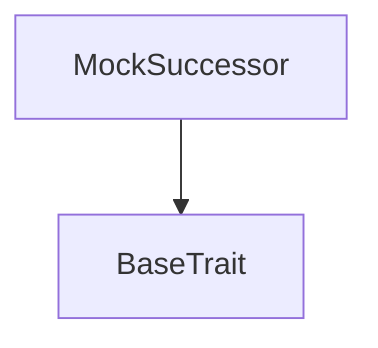

# Tact compilation report
Contract: MockSuccessor
BoC Size: 223 bytes

## Structures (Structs and Messages)
Total structures: 47

### DataSize
TL-B: `_ cells:int257 bits:int257 refs:int257 = DataSize`
Signature: `DataSize{cells:int257,bits:int257,refs:int257}`

### SignedBundle
TL-B: `_ signature:fixed_bytes64 signedData:remainder<slice> = SignedBundle`
Signature: `SignedBundle{signature:fixed_bytes64,signedData:remainder<slice>}`

### StateInit
TL-B: `_ code:^cell data:^cell = StateInit`
Signature: `StateInit{code:^cell,data:^cell}`

### Context
TL-B: `_ bounceable:bool sender:address value:int257 raw:^slice = Context`
Signature: `Context{bounceable:bool,sender:address,value:int257,raw:^slice}`

### SendParameters
TL-B: `_ mode:int257 body:Maybe ^cell code:Maybe ^cell data:Maybe ^cell value:int257 to:address bounce:bool = SendParameters`
Signature: `SendParameters{mode:int257,body:Maybe ^cell,code:Maybe ^cell,data:Maybe ^cell,value:int257,to:address,bounce:bool}`

### MessageParameters
TL-B: `_ mode:int257 body:Maybe ^cell value:int257 to:address bounce:bool = MessageParameters`
Signature: `MessageParameters{mode:int257,body:Maybe ^cell,value:int257,to:address,bounce:bool}`

### DeployParameters
TL-B: `_ mode:int257 body:Maybe ^cell value:int257 bounce:bool init:StateInit{code:^cell,data:^cell} = DeployParameters`
Signature: `DeployParameters{mode:int257,body:Maybe ^cell,value:int257,bounce:bool,init:StateInit{code:^cell,data:^cell}}`

### StdAddress
TL-B: `_ workchain:int8 address:uint256 = StdAddress`
Signature: `StdAddress{workchain:int8,address:uint256}`

### VarAddress
TL-B: `_ workchain:int32 address:^slice = VarAddress`
Signature: `VarAddress{workchain:int32,address:^slice}`

### BasechainAddress
TL-B: `_ hash:Maybe int257 = BasechainAddress`
Signature: `BasechainAddress{hash:Maybe int257}`

### Transfer
TL-B: `transfer#5fcc3d14 queryId:uint64 newOwner:address responseDestination:address customPayload:Maybe ^cell forwardAmount:coins forwardPayload:remainder<slice> = Transfer`
Signature: `Transfer{queryId:uint64,newOwner:address,responseDestination:address,customPayload:Maybe ^cell,forwardAmount:coins,forwardPayload:remainder<slice>}`

### OwnershipAssigned
TL-B: `ownership_assigned#05138d91 queryId:uint64 prevOwner:address forwardPayload:remainder<slice> = OwnershipAssigned`
Signature: `OwnershipAssigned{queryId:uint64,prevOwner:address,forwardPayload:remainder<slice>}`

### Excesses
TL-B: `excesses#d53276db queryId:uint64 = Excesses`
Signature: `Excesses{queryId:uint64}`

### GetStaticData
TL-B: `get_static_data#2fcb26a2 queryId:uint64 = GetStaticData`
Signature: `GetStaticData{queryId:uint64}`

### ReportStaticData
TL-B: `report_static_data#8b771735 queryId:uint64 index:int257 collection:address = ReportStaticData`
Signature: `ReportStaticData{queryId:uint64,index:int257,collection:address}`

### NftData
TL-B: `_ isInitialized:bool index:int257 collectionAddress:address ownerAddress:address individualContent:^cell = NftData`
Signature: `NftData{isInitialized:bool,index:int257,collectionAddress:address,ownerAddress:address,individualContent:^cell}`

### CollectionData
TL-B: `_ nextItemIndex:int257 collectionContent:^cell ownerAddress:address = CollectionData`
Signature: `CollectionData{nextItemIndex:int257,collectionContent:^cell,ownerAddress:address}`

### RoyaltyParams
TL-B: `_ numerator:int257 denominator:int257 destination:address = RoyaltyParams`
Signature: `RoyaltyParams{numerator:int257,denominator:int257,destination:address}`

### ItemInit
TL-B: `item_init#41540001 owner:address season:uint16 tier:uint8 paid:coins mintedAt:uint32 occasion:uint8 mediaRef:uint256 = ItemInit`
Signature: `ItemInit{owner:address,season:uint16,tier:uint8,paid:coins,mintedAt:uint32,occasion:uint8,mediaRef:uint256}`

### MintItem
TL-B: `mint_item#41540002 index:uint64 newOwner:address season:uint16 tier:uint8 paid:coins occasion:uint8 mediaRef:uint256 remit:coins = MintItem`
Signature: `MintItem{index:uint64,newOwner:address,season:uint16,tier:uint8,paid:coins,occasion:uint8,mediaRef:uint256,remit:coins}`

### Proceeds
TL-B: `proceeds#41540003  = Proceeds`
Signature: `Proceeds{}`

### MintOk
TL-B: `mint_ok#41540005 index:uint64 = MintOk`
Signature: `MintOk{index:uint64}`

### UpgradeStart
TL-B: `upgrade_start#41540010 queryId:uint64 = UpgradeStart`
Signature: `UpgradeStart{queryId:uint64}`

### UpgradeRequest
TL-B: `upgrade_request#41540011 index:uint64 owner:address season:uint16 tier:uint8 paid:coins mintedAt:uint32 hands:uint32 engravings:Maybe ^cell occasion:uint8 mediaRef:uint256 mediaLog:Maybe ^cell = UpgradeRequest`
Signature: `UpgradeRequest{index:uint64,owner:address,season:uint16,tier:uint8,paid:coins,mintedAt:uint32,hands:uint32,engravings:Maybe ^cell,occasion:uint8,mediaRef:uint256,mediaLog:Maybe ^cell}`

### UpgradeAccept
TL-B: `upgrade_accept#41540012 index:uint64 owner:address season:uint16 tier:uint8 paid:coins mintedAt:uint32 hands:uint32 engravings:Maybe ^cell occasion:uint8 mediaRef:uint256 mediaLog:Maybe ^cell = UpgradeAccept`
Signature: `UpgradeAccept{index:uint64,owner:address,season:uint16,tier:uint8,paid:coins,mintedAt:uint32,hands:uint32,engravings:Maybe ^cell,occasion:uint8,mediaRef:uint256,mediaLog:Maybe ^cell}`

### UpgradeDone
TL-B: `upgrade_done#41540013 index:uint64 = UpgradeDone`
Signature: `UpgradeDone{index:uint64}`

### BurnConfirm
TL-B: `burn_confirm#41540014  = BurnConfirm`
Signature: `BurnConfirm{}`

### UpgradeAbort
TL-B: `upgrade_abort#41540015 index:uint64 = UpgradeAbort`
Signature: `UpgradeAbort{index:uint64}`

### ProposeMinter
TL-B: `propose_minter#41540020 minter:address = ProposeMinter`
Signature: `ProposeMinter{minter:address}`

### RemoveMinter
TL-B: `remove_minter#41540021 minter:address = RemoveMinter`
Signature: `RemoveMinter{minter:address}`

### ProposePayout
TL-B: `propose_payout#41540022 payout:address = ProposePayout`
Signature: `ProposePayout{payout:address}`

### ApplyPayout
TL-B: `apply_payout#41540023  = ApplyPayout`
Signature: `ApplyPayout{}`

### ProposeBaseUri
TL-B: `propose_base_uri#41540024 uri:^string = ProposeBaseUri`
Signature: `ProposeBaseUri{uri:^string}`

### ApplyBaseUri
TL-B: `apply_base_uri#41540025  = ApplyBaseUri`
Signature: `ApplyBaseUri{}`

### SetSuccessor
TL-B: `set_successor#41540026 successor:address = SetSuccessor`
Signature: `SetSuccessor{successor:address}`

### Withdraw
TL-B: `withdraw#41540027  = Withdraw`
Signature: `Withdraw{}`

### ProposeCode
TL-B: `propose_code#41540028 code:^cell = ProposeCode`
Signature: `ProposeCode{code:^cell}`

### ApplyCode
TL-B: `apply_code#41540029  = ApplyCode`
Signature: `ApplyCode{}`

### CancelCode
TL-B: `cancel_code#4154002a  = CancelCode`
Signature: `CancelCode{}`

### EngraveReq
TL-B: `engrave_req#41540070 index:uint64 text:^string = EngraveReq`
Signature: `EngraveReq{index:uint64,text:^string}`

### EngraveFrom
TL-B: `engrave_from#41540071 owner:address text:^string fee:coins = EngraveFrom`
Signature: `EngraveFrom{owner:address,text:^string,fee:coins}`

### SetMediaReq
TL-B: `set_media_req#41540072 index:uint64 occasion:uint8 mediaRef:uint256 = SetMediaReq`
Signature: `SetMediaReq{index:uint64,occasion:uint8,mediaRef:uint256}`

### SetMediaFrom
TL-B: `set_media_from#41540073 owner:address occasion:uint8 mediaRef:uint256 firstFee:coins changeFee:coins = SetMediaFrom`
Signature: `SetMediaFrom{owner:address,occasion:uint8,mediaRef:uint256,firstFee:coins,changeFee:coins}`

### SetItemFees
TL-B: `set_item_fees#41540074 engraveFee:coins mediaFee:coins changeFee:coins = SetItemFees`
Signature: `SetItemFees{engraveFee:coins,mediaFee:coins,changeFee:coins}`

### ItemFees
TL-B: `_ engrave:int257 media:int257 change:int257 = ItemFees`
Signature: `ItemFees{engrave:int257,media:int257,change:int257}`

### SetPrice
TL-B: `set_price#41540090 price:coins = SetPrice`
Signature: `SetPrice{price:coins}`

### MockSuccessor$Data
TL-B: `_ price:coins = MockSuccessor`
Signature: `MockSuccessor{price:coins}`

## Get methods
Total get methods: 0

## Exit codes
* 2: Stack underflow
* 3: Stack overflow
* 4: Integer overflow
* 5: Integer out of expected range
* 6: Invalid opcode
* 7: Type check error
* 8: Cell overflow
* 9: Cell underflow
* 10: Dictionary error
* 11: 'Unknown' error
* 12: Fatal error
* 13: Out of gas error
* 14: Virtualization error
* 32: Action list is invalid
* 33: Action list is too long
* 34: Action is invalid or not supported
* 35: Invalid source address in outbound message
* 36: Invalid destination address in outbound message
* 37: Not enough Toncoin
* 38: Not enough extra currencies
* 39: Outbound message does not fit into a cell after rewriting
* 40: Cannot process a message
* 41: Library reference is null
* 42: Library change action error
* 43: Exceeded maximum number of cells in the library or the maximum depth of the Merkle tree
* 50: Account state size exceeded limits
* 128: Null reference exception
* 129: Invalid serialization prefix
* 130: Invalid incoming message
* 131: Constraints error
* 132: Access denied
* 133: Contract stopped
* 134: Invalid argument
* 135: Code of a contract was not found
* 136: Invalid standard address
* 138: Not a basechain address
* 18041: not enough for the upgrade

## Trait inheritance diagram

## Contract dependency diagram

